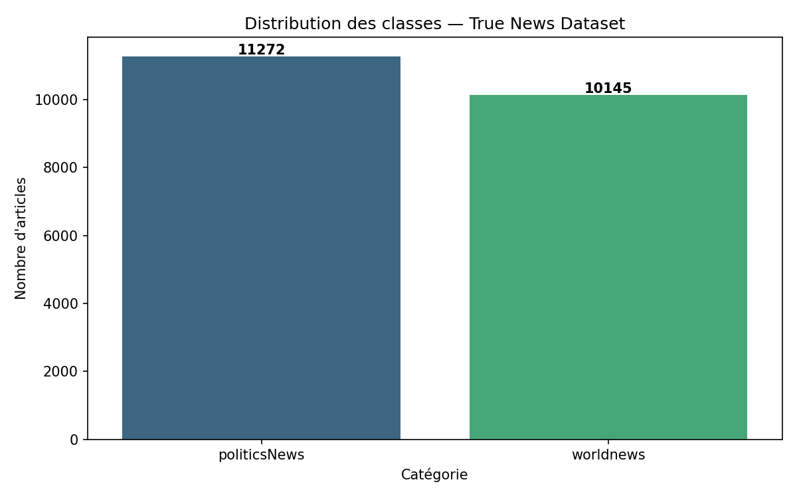
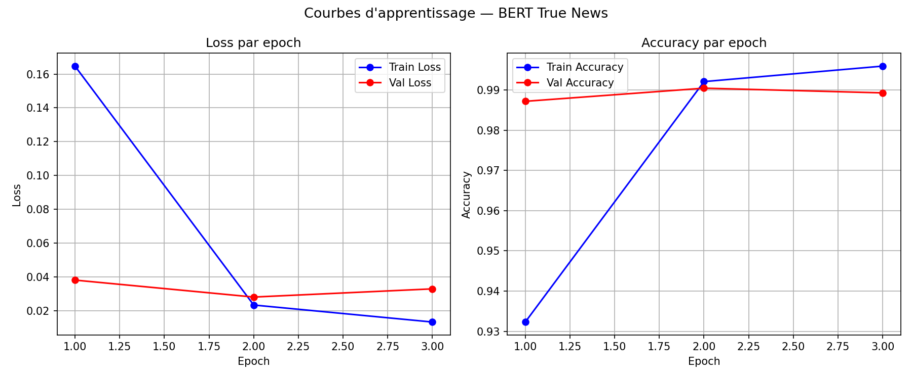
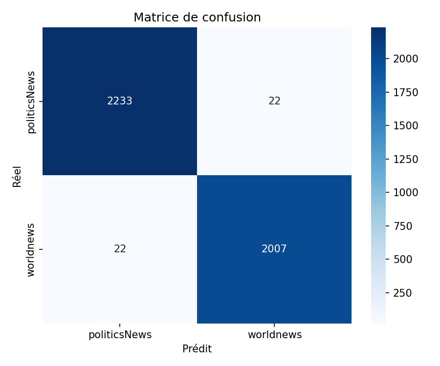
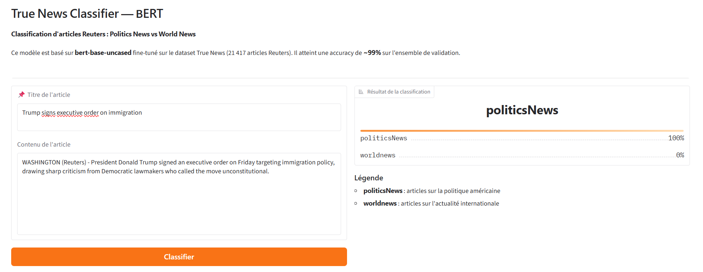
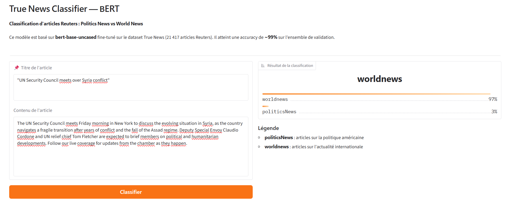
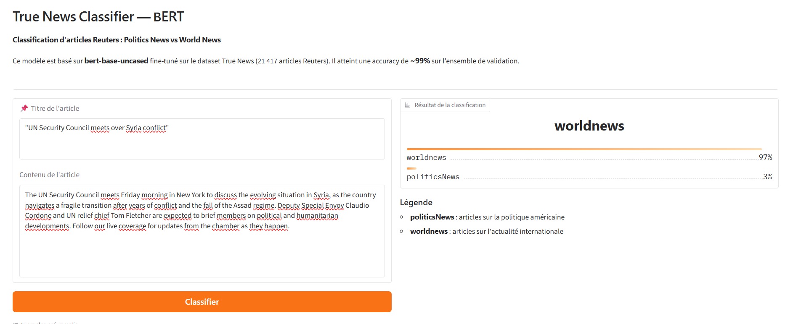

# 🤖 BERT Classification — True News Dataset

**Fine-tuning de BERT pour la classification d'articles Reuters**  
*(politicsNews vs worldnews)*

Master IA — DIT Dakar | Deep Learning  
**Binôme :** [Hamady Ngansou SABALY] & [Seydou Gueye]

---

## 📌 Description du projet

Ce projet implémente le fine-tuning du modèle **bert-base-uncased** 
pour classifier des articles de presse Reuters en deux catégories :
- **politicsNews** : articles sur la politique américaine
- **worldnews** : articles sur l'actualité internationale

---

## 📊 Dataset

| Propriété | Valeur |
|-----------|--------|
| Source | ISOT True News Dataset (Reuters) |
| Taille totale | 21 417 articles |
| Nombre de classes | 2 |
| Langue | Anglais |
| Split | 80% train / 20% validation |

### Distribution des classes


| Classe | Exemples | Pourcentage |
|--------|----------|-------------|
| politicsNews | 11 272 | 52.6% |
| worldnews | 10 145 | 47.4% |
| **Ratio max/min** | **1.11:1** | ✅ Équilibré |

---

## Architecture du modèle
Texte (title + [SEP] + content)

↓

Tokenizer BERT (max_length=128)

↓

BERT Encoder (12 couches, 768 dimensions)

↓

Vecteur [CLS] (768 dimensions)

↓

Dropout (0.3)

↓

Couche linéaire (768 → 2)

↓

[politicsNews, worldnews]

### Choix techniques justifiés

| Paramètre | Valeur | Justification |
|-----------|--------|---------------|
| Modèle | bert-base-uncased | Dataset en anglais |
| max_length | 128 | Médiane ~370 mots, compromis vitesse/performance sur Colab T4 |
| Batch size | 16 | Contrainte VRAM GPU T4 (15GB) |
| Gradient accumulation | 4 steps | Batch effectif = 64 |
| Learning rate | 2e-5 | Typique fine-tuning BERT, évite le catastrophic forgetting |
| Epochs | 3 | BERT converge vite, overfitting détecté à l'epoch 3 |
| Optimiseur | AdamW (weight_decay=0.01) | Standard fine-tuning transformers |
| Scheduler | Linéaire avec warmup (10%) | Stabilise l'entraînement en début |
| Loss | CrossEntropyLoss | Classification multi-classes |

---

## Résultats

### Courbes d'apprentissage


| Epoch | Train Loss | Val Loss | Train Acc | Val Acc | Val F1 |
|-------|-----------|----------|-----------|---------|--------|
| 1 | 0.1630 | 0.0390 | 93.3% | 98.8% | ~0.988 |
| 2 | 0.0230 | 0.0280 | 99.0% | 99.0% | ~0.990 |
| 3 | 0.0150 | 0.0330 | 99.6% | 99.0% | ~0.990 |

> ✅ **Meilleur modèle sauvegardé à l'epoch 2** (val_loss=0.0280)

### Analyse des courbes
- **Epoch 1→2** : forte amélioration — BERT adapte rapidement ses représentations
- **Epoch 3** : légère remontée de la val_loss → début d'overfitting, arrêt justifié à 3 epochs

### Matrice de confusion


| | Prédit politicsNews | Prédit worldnews |
|--|--|--|
| **Réel politicsNews** | 2232 | 23 |
| **Réel worldnews** | 18 | 2011 |

### Métriques finales

| Métrique | Valeur |
|----------|--------|
| **Accuracy** | **~99%** |
| **F1-score macro** | **~99%** |
| Erreurs totales | 44 / 4284 |

---

## 🚀 Installation et exécution

### Prérequis
```bash
pip install -r requirements.txt
```

### Entraînement (Google Colab recommandé)
```bash
# 1. Uploader les fichiers sur Colab
# 2. Créer les dossiers
mkdir -p data results
mv True.csv data/

# 3. Lancer l'entraînement
python train.py
```

### Démonstration Gradio
```bash
# Placer best_model.pt dans results/
python demo.py
```

L'interface sera accessible à : `http://localhost:7860`

---
## 🎯 Démo Gradio

### Exemple politicsNews


### Exemple worldnews  


## 🛠️ Étapes de réalisation et difficultés rencontrées

### Étapes
1. Analyse et exploration du dataset (distribution, longueur des textes)
2. Implémentation de la classe `TextClassificationDataset`
3. Fine-tuning de BERT avec boucle PyTorch manuelle
4. Entraînement sur Google Colab (GPU T4)
5. Déploiement de l'interface Gradio

### Difficultés rencontrées
- **Encodage des textes** : caractères mal encodés dans le CSV (“, ’) → résolu avec `clean_text()`
- **`max_length`** : textes très longs (max 5182 mots) → choix de 128 tokens comme compromis vitesse/performance sur Colab
- **Overfitting epoch 3** : val_loss remonte → sauvegarde du meilleur modèle à l'epoch 2
- **Compatibilité Windows/Colab** : `num_workers=2` plantait sur Windows → fixé à `num_workers=0`

## Limites du modèle

Le modèle est entraîné exclusivement sur des articles Reuters de 2016-2017 couvrant deux catégories : politique américaine 
et actualité internationale. Il ne reconnaît pas les articles sportifs, économiques ou culturels. Ces textes sont classés 
de façon arbitraire car hors de sa distribution d'entraînement voire image ci-dessous.

## Structure du projet
bert-classification-true-news/

├── data/

│   └── True.csv

├── results/

│   ├── best_model.pt

│   ├── class_distribution.png

│   ├── training_curves.png

│   └── confusion_matrix.png

├── dataset.py

├── model.py

├── train.py

├── demo.py

├── utils.py

├── requirements.txt

└── README.md
## 👥 Répartition du travail

| Fichier | Responsable |
|---------|-------------|
| `utils.py` | [Sabaly] |
| `dataset.py` | [Sabaly] |
| `model.py` | [Gueye] |
| `train.py` | [Gueye] |
| `demo.py` | [Sabaly&Gueye] |
| `README.md` | [Sabaly&Gueye] |
